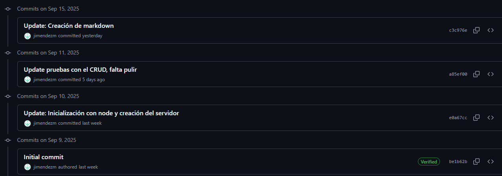

Este proyecto consiste en una API desarrollada en **Node.js** que se conecta a la base de datos **AdventureWorks2022** ejecutada en **SQL Server dentro de Docker en WSL2**.  

> ⚠️ Nota importante: Inicialmente subí el proyecto en un repositorio equivocado de GitHub Classroom, ya que no conocía bien la herramienta. Posteriormente, lo corregí y aquí dejo el enlace al repositorio que realmente utilicé, junto con una evidencia de mis commits.

**Repositorio utilizado:** [AdventureWorks API en GitHub](https://github.com/jimendez/adventureworks-api)  

**Evidencia de commits:**  


---

# Instalación Paso a Paso

## 1. Configuración Inicial de WSL2
```bash
# Habilitar WSL2 en PowerShell (como Administrador)
wsl --install
wsl --set-default-version 2

# Instalar Ubuntu desde Microsoft Store
# Abrir Ubuntu y actualizar sistema
sudo apt update && sudo apt upgrade -y
```

## 2. Instalación de Docker en WSL2
```bash
# Instalar Docker
sudo apt install docker.io -y

# Iniciar servicio Docker
sudo service docker start

# Agregar usuario al grupo docker
sudo usermod -aG docker $USER

# Verificar instalación
docker --version

# Reiniciar sesión para aplicar cambios
exit
# Reabrir Ubuntu
```

## 3. Configuración de SQL Server en Docker
```bash
# Descargar imagen de SQL Server 2022
docker pull mcr.microsoft.com/mssql/server:2022-latest

# Crear y ejecutar contenedor
docker run -e 'ACCEPT_EULA=Y' -e 'MSSQL_SA_PASSWORD=SqlServer@2024'    -p 14333:1433 --name sqlcontainerwsl -d    -v /home/$(whoami)/backups:/var/opt/mssql/backups    mcr.microsoft.com/mssql/server:2022-latest

# Verificar que el contenedor está corriendo
docker ps

# Ver logs del contenedor
docker logs sqlcontainerwsl
```

## 4. Instalación de Node.js y Herramientas
```bash
# Instalar Node.js
curl -fsSL https://deb.nodesource.com/setup_18.x | sudo -E bash -
sudo apt-get install -y nodejs

# Instalar herramientas de desarrollo
sudo apt-get install -y build-essential

# Verificar instalaciones
node --version
npm --version
```

## 5. Configuración del Proyecto
```bash
# Clonar repositorio 
git clone https://github.com/jimendezm/Tarea1-BD2.git
cd adventureworks-api

# Instalar dependencias
npm install

# Crear archivo de variables de entorno
touch variables_entorno.env
```

## 6. Configuración de Variables de Entorno
Editar el archivo `variables_entorno.env`:

```env
DB_SERVER=localhost
DB_PORT=14333
DB_NAME=AdventureWorks2022
DB_USER=SA
DB_PASSWORD=SqlServer@2024
DB_ENCRYPT=false
DB_TRUST_CERT=true
DB_CONNECT_TIMEOUT=60000
DB_REQUEST_TIMEOUT=60000
PORT=3000
NODE_ENV=development
```

## 7. Restauración de Base de Datos AdventureWorks
```bash
# Crear directorio para backups
mkdir ~/backups
cd ~/backups

# Descargar AdventureWorks2022 (reemplazar con URL actual)
wget https://github.com/Microsoft/sql-server-samples/releases/download/adventureworks/AdventureWorks2022.bak

# Restaurar base de datos
sqlcmd -S localhost,14333 -U SA -P "SqlServer@2024" -Q "
RESTORE DATABASE AdventureWorks2022 
FROM DISK = '/var/opt/mssql/backups/AdventureWorks2022.bak'
WITH MOVE 'AdventureWorks2022' TO '/var/opt/mssql/data/AdventureWorks2022.mdf',
MOVE 'AdventureWorks2022_log' TO '/var/opt/mssql/data/AdventureWorks2022_log.ldf';
"
```

## 8. Creación de Stored Procedures
```bash
# Ejecutar script de stored procedures
sqlcmd -S localhost,14333 -U SA -P "SqlServer@2024" -i StoredProcedures.sql

# Verificar creación
sqlcmd -S localhost,14333 -U SA -P "SqlServer@2024" -Q "
USE AdventureWorks2022;
SELECT name, type_desc, create_date 
FROM sys.objects 
WHERE type = 'P' AND name LIKE 'usp%';
"
```

## 9. Ejecución de la API
```bash
# Modo desarrollo
npm run dev

# Modo producción
npm start

# Verificar funcionamiento
curl http://localhost:3000/health
```

---

# Endpoints de la API

### Personas
- **GET** `/api/personas` - Obtener todas las personas  
- **GET** `/api/personas/:id` - Obtener persona por ID  

### Órdenes de Venta
- **GET** `/api/ordenes-venta` - Obtener todas las órdenes  
- **GET** `/api/ordenes-venta/:id` - Obtener orden por ID  

### Sistema
- **GET** `/health` - Estado del sistema y base de datos  
- **GET** `/` - Información de la API y endpoints disponibles  

---

# Datos de Prueba

### Ejemplos de Consultas con cURL
```bash
# Obtener todas las órdenes (con paginación)
curl -X GET "http://localhost:3000/api/ordenes?page=1&limit=10" 

# Obtener orden específica por ID
curl -X GET "http://localhost:3000/api/ordenes/43659"

# Crear nueva orden de venta
curl -X POST "http://localhost:3000/api/ordenes" \
  -H "Content-Type: application/json" \
  -d '{
    "CustomerID": 1,
    "ShipDate": "2025-09-15", 
    "DueDate": "2025-09-20",
    "Status": 1,
    "OnlineOrderFlag": true,
    "SubTotal": 150.75,
    "TaxAmt": 15.08,
    "Freight": 8.50,
    "Comment": "Orden de prueba desde API"
  }'

# Actualizar orden existente
curl -X PUT "http://localhost:3000/api/ordenes/43659" \
  -H "Content-Type: application/json" \
  -d '{
    "Status": 2,
    "Comment": "Orden actualizada - En proceso"
  }'

# Eliminar orden (si no tiene detalles asociados)
curl -X DELETE "http://localhost:3000/api/ordenes/43659"

# Obtener órdenes de un cliente específico
curl -X GET "http://localhost:3000/api/clientes/1/ordenes?limit=5"

# Verificar salud del sistema y base de datos
curl -X GET "http://localhost:3000/health"

# Obtener información de la API y endpoints disponibles
curl -X GET "http://localhost:3000/"
```

---

# Dificultades y Soluciones

### Dificultad 1: Configuración de Docker y Puertos
**Problema:** El contenedor de SQL Server no era accesible desde el host  
**Solución:**
```bash
# Verificar mapeo de puertos
docker ps
# Asegurar que el puerto 14333 está mapeado a 1433
```

### Dificultad 2: Permisos de Archivos en WSL2
**Problema:** No se podía acceder a los archivos de backup desde Docker  
**Solución:**
```bash
# Dar permisos adecuados
sudo chmod 755 ~/backups
sudo chown $(whoami):$(whoami) ~/backups/*.bak
```

### Dificultad 3: Conexión a la Base de Datos
**Problema:** Timeout en la conexión desde Node.js  
**Solución:** Aumentar timeouts en configuración:
```javascript
options: {
  connectTimeout: 60000,
  requestTimeout: 60000,
  encrypt: false,
  trustServerCertificate: true
}
```

### Dificultad 4: Stored Procedures Existentes
**Problema:** Conflictos con stored procedures preexistentes en AdventureWorks  
**Solución:** Usar prefijos únicos para los procedures:
```sql
-- En lugar de uspObtenerTodosProductos
CREATE PROCEDURE uspAW_ObtenerTodosProductos
```

### Dificultad 5: Variables de Entorno
**Problema:** Las variables no se cargaban correctamente  
**Solución:** Especificar ruta absoluta:
```javascript
require('dotenv').config({ path: path.resolve(__dirname, 'variables_entorno.env') });
```

